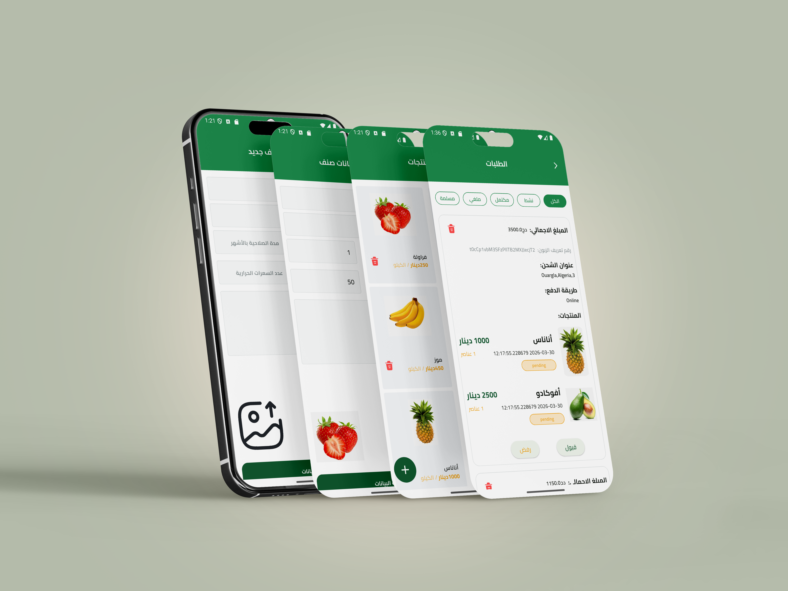

# ThimarHub-Admin-Dashboard


## 📝 Description

ThimarHub-Admin-Dashboard is a sophisticated and high-performance administrative solution built with Flutter, designed to provide seamless management for modern e-commerce ecosystems. Serving as the vital backend companion to mobile applications, this dashboard offers a centralized platform for overseeing business operations with precision. It features a robust authentication system for secure data access and leverages comprehensive testing frameworks to ensure long-term stability and reliability. With its intuitive design and cross-platform capabilities, ThimarHub-Admin-Dashboard empowers administrators to efficiently manage workflows, enhance productivity, and maintain full control over their digital marketplace.



[](https://www.youtube.com/watch?v=ssI5igt9Mt0)

## Screenshots

| Login Screen | Dashboard Screen | Products Screen |
|:------------:|:----------------:|:---------------:|
|  |  |  |

| Orders Screen | Add Product Screen | Edit Product Screen |
|:-------------:|:------------------:|:------------------:|
|  |  |  |

## ✨ Features

- Auth
- Dashboard
- Orders Management
- Products Management


## 🛠️ Tech Stack

- 💙 Flutter


## 📦 Key Dependencies

```
version: 1.0.0+1
sdk: flutter
cupertino_icons: ^1.0.8
image_picker: ^1.2.1
skeletonizer: ^2.1.2
dartz: ^0.10.1
firebase_core: ^3.6.0
firebase_storage: ^12.3.0
cloud_firestore: ^5.6.12
path: ^1.9.1
flutter_bloc: ^9.1.1
get_it: ^9.2.0
```

## 📁 Project Structure

```
.
├── analysis_options.yaml
├── assets
│   ├── fonts
│   │   ├── Cairo-Bold.ttf
│   │   ├── Cairo-Medium.ttf
│   │   ├── Cairo-Regular.ttf
│   │   └── Cairo-SemiBold.ttf
│   ├── images
│   │   ├── dashboard
│   │   │   ├── checked.svg
│   │   │   ├── open_cardboard_box.svg
│   │   │   ├── shipping_car.svg
│   │   │   └── shipping_chart.svg
│   │   ├── helper
│   │   │   ├── false_icon.svg
│   │   │   ├── no_data.svg
│   │   │   └── true_circle_container.svg
│   │   └── products
│   │       ├── ananas.png
│   │       ├── avocado.png
│   │       ├── bananas.png
│   │       ├── mango.png
│   │       ├── strawberry.png
│   │       └── watermelon.png
│   ├── l10n
│   │   ├── ar.json
│   │   ├── de.json
│   │   ├── en.json
│   │   ├── es.json
│   │   └── fr.json
│   └── previews
│       ├── add_product_view.png
│       ├── dashboard_view.png
│       ├── edit_product.png
│       ├── login_view.png
│       ├── order_view.png
│       └── product_view.png
├── devtools_options.yaml
├── lib
│   ├── config
│   │   └── urls.dart
│   ├── constants.dart
│   ├── core
│   │   ├── enums
│   │   │   └── order_status_enum.dart
│   │   ├── errors
│   │   │   ├── custom_exceptions.dart
│   │   │   └── failures.dart
│   │   ├── helper
│   │   │   ├── build_app_bar.dart
│   │   │   ├── get_dummy_order.dart
│   │   │   ├── get_dummy_products.dart
│   │   │   ├── show_false_snack_bar.dart
│   │   │   ├── show_snack_bar.dart
│   │   │   └── show_true_snack_bar.dart
│   │   ├── routing
│   │   │   └── on_generate_route.dart
│   │   ├── services
│   │   │   ├── custom_bloc_observer.dart
│   │   │   ├── database_service.dart
│   │   │   ├── firebase_auth_services.dart
│   │   │   ├── firebase_cloud_storage.dart
│   │   │   ├── firestore_service.dart
│   │   │   ├── get_it_service.dart
│   │   │   ├── shared_preferences_singleton.dart
│   │   │   ├── storage_service.dart
│   │   │   └── supabase_storage_service.dart
│   │   ├── utils
│   │   │   ├── app_styles.dart
│   │   │   ├── assets.dart
│   │   │   ├── backend_break_point.dart
│   │   │   └── colors_data.dart
│   │   └── widgets
│   │       ├── custom_button.dart
│   │       ├── custom_check_box.dart
│   │       ├── custom_empty_data_image.dart
│   │       ├── custom_error_widget.dart
│   │       ├── custom_image_network.dart
│   │       ├── custom_loading_indicator.dart
│   │       └── custom_text_form_field.dart
│   ├── features
│   │   ├── auth
│   │   │   ├── data
│   │   │   │   ├── models
│   │   │   │   │   └── user_model.dart
│   │   │   │   └── repos
│   │   │   │       └── auth_repo_impl.dart
│   │   │   ├── domain
│   │   │   │   ├── entities
│   │   │   │   │   └── user_entity.dart
│   │   │   │   └── repos
│   │   │   │       └── auth_repo.dart
│   │   │   └── presentation
│   │   │       ├── manager
│   │   │       │   └── sign_in_cubit
│   │   │       │       ├── sign_in_cubit.dart
│   │   │       │       └── sign_in_state.dart
│   │   │       └── views
│   │   │           ├── login_view.dart
│   │   │           └── widgets
│   │   │               ├── login_view_body.dart
│   │   │               ├── login_view_body_bloc_consumer.dart
│   │   │               └── password_field.dart
│   │   ├── dashboard
│   │   │   └── presentation
│   │   │       └── views
│   │   │           ├── dashboard_view.dart
│   │   │           └── widgets
│   │   │               ├── dashboard_item.dart
│   │   │               ├── dashboard_view_body.dart
│   │   │               └── log_out_button.dart
│   │   ├── orders
│   │   │   ├── data
│   │   │   │   ├── models
│   │   │   │   │   ├── order_model.dart
│   │   │   │   │   ├── payment_card_model.dart
│   │   │   │   │   ├── product_order_model.dart
│   │   │   │   │   └── shipping_address_model.dart
│   │   │   │   └── repos
│   │   │   │       └── orders_repo_impl.dart
│   │   │   ├── domain
│   │   │   │   ├── entities
│   │   │   │   │   ├── order_entity.dart
│   │   │   │   │   ├── payment_card_entity.dart
│   │   │   │   │   ├── product_order_entity.dart
│   │   │   │   │   └── shipping_address_entity.dart
│   │   │   │   └── repos
│   │   │   │       └── orders_repo.dart
│   │   │   └── presentation
│   │   │       ├── manager
│   │   │       │   └── cubits
│   │   │       │       ├── delete_orders_cubit
│   │   │       │       │   ├── delete_orders_cubit.dart
│   │   │       │       │   └── delete_orders_state.dart
│   │   │       │       ├── fetch_orders_cubit
│   │   │       │       │   ├── fetch_orders_cubit.dart
│   │   │       │       │   └── fetch_orders_state.dart
│   │   │       │       └── update_orders_cubit
│   │   │       │           └── cubit
│   │   │               ├── update_order_cubit.dart
│   │   │               └── update_order_state.dart
│   │   │       └── views
│   │   │           ├── orders_view.dart
│   │   │           └── widgets
│   │   │               ├── cancel_button.dart
│   │   │               ├── delete_order_bloc_consumer.dart
│   │   │               ├── filter_section.dart
│   │   │               ├── filter_section_item.dart
│   │   │               ├── order_action_buttons.dart
│   │   │               ├── order_status_button.dart
│   │   │               ├── orders_item.dart
│   │   │               ├── orders_item_list_view.dart
│   │   │               ├── orders_item_list_view_bloc_builder.dart
│   │   │               ├── orders_line.dart
│   │   │               ├── orders_view_body.dart
│   │   │               ├── product_order_item.dart
│   │   │               └── update_order_bloc_builder.dart
│   │   └── products_management
│   │       ├── data
│   │       │   ├── models
│   │       │   │   ├── product_model.dart
│   │       │   │   └── review_model.dart
│   │       │   └── repos
│   │       │       ├── images_repo_impl.dart
│   │       │       └── products_repo_impl.dart
│   │       ├── domain
│   │       │   ├── entities
│   │       │   │   ├── product_entity.dart
│   │       │   │   └── review_entity.dart
│   │       │   └── repos
│   │       │       ├── images_repo.dart
│   │       │       └── products_repo.dart
│   │       └── presentation
│   │           ├── manager
│   │           │   └── cubits
│   │           │       ├── create_product_cubit
│   │           │       │   ├── add_product_cubit.dart
│   │           │       │   └── add_product_state.dart
│   │           │       ├── get_products_cubit
│   │           │       │   ├── products_cubit.dart
│   │           │       │   └── products_state.dart
│   │           │       ├── remove_product_cubit
│   │           │       │   ├── remove_product_cubit.dart
│   │           │       │   └── remove_product_state.dart
│   │           │       └── update_product_cubit
│   │           │           ├── update_product_cubit.dart
│   │           │           └── update_product_state.dart
│   │           └── views
│   │               ├── products_management_view.dart
│   │               └── widgets
│   │                   ├── add_image_section.dart
│   │                   ├── add_new_product_view.dart
│   │                   ├── add_new_product_view_bloc_builder.dart
│   │                   ├── add_new_product_view_body.dart
│   │                   ├── edit_image_section.dart
│   │                   ├── edit_product_information_view.dart
│   │                   ├── edit_product_information_view_bloc_builder.dart
│   │                   ├── edit_product_information_view_body.dart
│   │                   ├── fruit_item.dart
│   │                   ├── is_featured_field.dart
│   │                   ├── is_organic_field.dart
│   │                   ├── products_grid_view.dart
│   │                   ├── products_grid_view_bloc_builder.dart
│   │                   ├── products_management_view_body.dart
│   │                   ├── remove_product_Icon_bloc_consumer.dart
│   │                   └── remove_product_button_bloc_consumer.dart
│   ├── locale_keys.dart
│   └── main.dart
├── pubspec.lock
├── pubspec.yaml
└── test
    └── widget_test.dart
```

## 🛠️ Development Setup

### Flutter Setup
1. Install [Flutter SDK](https://flutter.dev/docs/get-started/install)
2. Run: `flutter pub get`
3. Start the app: `flutter run`


## 👥 Contributing

Contributions are welcome! Here's how you can help:

1. **Fork** the repository
2. **Clone** your fork: `git clone https://github.com/Nidhal-Khazene/ThimarHub-Admin-Dashboard.git`
3. **Create** a new branch: `git checkout -b feature/your-feature`
4. **Commit** your changes: `git commit -am 'Add some feature'`
5. **Push** to your branch: `git push origin feature/your-feature`
6. **Open** a pull request

Please ensure your code follows the project's style guidelines and includes tests where applicable.
